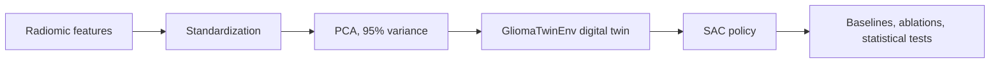

# Brain Tumour Digital Twin

A radiomics-conditioned digital twin of glioma progression, paired with a
Soft Actor-Critic (SAC) policy that learns treatment schedules under
toxicity constraints.

## Abstract

We build a per-patient digital twin from MRI-derived radiomic features and
reduce them via PCA to a low-dimensional state. A simulated dynamics model
captures growth, chemotherapy and radiotherapy efficacy, and toxicity
accumulation. A SAC agent searches over four discrete actions (observe,
TMZ, RT, combined) to maximise survival under a toxicity-aware reward,
and is benchmarked against random and rule-based baselines with formal
significance testing and a reward-design ablation.

## Pipeline



## Repository layout

```
Brain_Tumour_Digital_Twin/
├── src/
│   ├── __init__.py
│   └── core.py              # Config, GliomaTwinEnv, SAC agent, checkpoint helpers
├── pca_pipeline.py          # raw radiomics -> PCA-reduced state
├── standardize_raw.py       # optional: build the un-reduced patient state
├── train_sac.py             # multi-seed SAC training
├── evaluate_policies.py     # baselines + reward-design ablation
├── requirements.txt
├── LICENSE
└── README.md
```

## Setup

```bash
python -m venv .venv
source .venv/bin/activate
pip install -r requirements.txt
```

## Reproduction

```bash
# 1. Reduce radiomic features to principal components.
python pca_pipeline.py \
    --input data/RADIOMICS_SELECTED_CASES.csv \
    --pca-out data/RADIOMICS_PCA_DATA.csv \
    --features-out data/PCA_EXTRACTED_RADIOMIC_PHENOTYPES.csv

# 2. Train SAC across multiple seeds.
python train_sac.py \
    --data data/RADIOMICS_PCA_DATA.csv \
    --out outputs/

# 3. Evaluate against baselines and run the reward ablation.
python evaluate_policies.py \
    --checkpoint outputs/seed_42/agent.pt \
    --scaler outputs/seed_42/scaler.pkl \
    --data data/RADIOMICS_PCA_DATA.csv \
    --out outputs/eval/
```

The `BRAIN_TWIN_DATA` environment variable can be set to override the
default data path.

## Status

Manuscript in preparation. Quantitative results, trained checkpoints, and
processed data are withheld pending publication.

## License

Copyright (c) 2026 Ocora. All rights reserved. See [LICENSE](LICENSE).
For commercial or research-collaboration enquiries, contact the authors.

## Disclaimer

Research prototype. Simulation only; not validated for clinical use and
not a medical device.

## Citation

```bibtex
@unpublished{brain_tumour_digital_twin,
  title  = {A Radiomics-Conditioned Digital Twin and Reinforcement-Learning
            Policy Search for Glioma Treatment Scheduling},
  author = {The Authors},
  note   = {Manuscript in preparation},
  year   = {2026}
}
```

## Contact

For access requests or collaboration, please contact the corresponding author.
